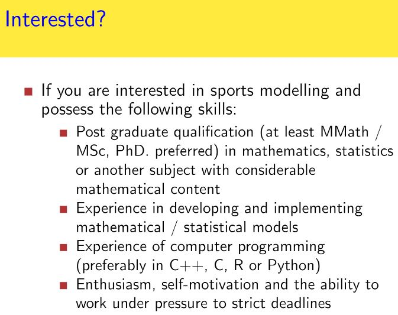

```{r setup, include = FALSE}
suppressMessages(library(tint))
# invalidate cache when the package version changes
knitr::opts_chunk$set(tidy = FALSE, cache.extra = packageVersion('tint'))
options(htmltools.dir.version = FALSE)
```

# 1. Introduction

<iframe width="560" height="315" src="https://www.youtube.com/embed/E9_eAm2tTns" frameborder="0" allowfullscreen></iframe>

  From above video we can know the professional gamblers can make profit from operators. However how do we broke bankers? There has no free lunch in the World. Kindly refer to below 
  


  Due to my previous research applied \$1 as long as the edge of EM^[Expectation Maximization] odds is over BK^[Odds price offer by Bookmakers] odds and concludes that the staking methods need to be improved.
  
  Here I tried to scrap the odds price from [7M](http://www.7msport.com/) and [NowGoal.com](http://www.nowgoal.com/) website^[You are feel free to read from [WebDriver-DynamicWebpage-Scrapping.](https://github.com/scibrokes/webdriver-dynamicwebpage-scrapping)], and apply Kelly-Criterion Model, from the simulatioin we can know that the EM model is profitable.
  
  - [Application of Kelly model in English Soccer session 2011/12](http://rpubs.com/englianhu/kelly_eng1112)
  - [Application of Kelly model in English Soccer session 2012/13](http://rpubs.com/englianhu/kelly_eng1213)
  
  Meanwhile, I conduct another resarch project which is [Betting-Strategy-and-Model-Validation](https://github.com/scibrokes/betting-strategy-and-model-validation) to validate the real data from a famous British sportsbook consultancy firm A. You might refer to the research as well. From that research we can know :-
  
  - How do British firm placed bets via agency A.
  - Analyse the trends of the staking.
  - The Profit and loss and money management.
  - The investment portfolio which application of an weight function get the optimal control parameter for dynamical fractional Kelly model.
  
  Below is my previous research paper **®Model** which was more sophiscated than *Dixon-Coles model*. You can refer it and I will just omit the Poison model as you can refer to below paper.^[**®Model** version II will be started in future.]
  
<iframe src="https://raw.githubusercontent.com/scibrokes/odds-modelling-and-testing-inefficiency-of-sports-bookmakers/master/Odds%20Modelling%20and%20Testing%20Inefficiency%20of%20Sports-Bookmakers/Odds_Modelling_and_Testing_Inefficiency_of_Sports-Bookmakers.pdf" style="width:5

  Due to the price of operators are flutucate from the initial price until the closed price. Therefore I try to enhance it and looking for the optimal timing for place bets. A weight function will be fit into the staking timing.

# 2. Data

## 2.1 Read Data

  I try to collect the soccer data from session 2010/11 until 12/13^[Collected the soccer data from sesson 2011/12 until 13/14. Bookmakers' odds data from session 2009/10 until 13/14 from both 7MSports and also NowGoal.com] as data research for this paper. Meanwhile, 

```{r load-data, echo = FALSE, results = 'asis'}
## Load and manipulate the dataset.
suppressMessages(library('turner'))

## Saved as RData format file in order to the save the read files time.
load('./data/dataset.RData')

```

  Due to the odds price of operators fluatuate as time goes by, therefore I try to analyse the trend of bookmakers' price for place bets.

# 3. Kelly Criterion

  The Paper *Niko Marttinen (2001)* had conducted a completed research as a professional gambler and directly point that the Kelly portfolio is the best strategy for money management.
  
  - compare fixed stake, full Kelly, ½ Kelly and ¼ Kelly.

<iframe src="https://raw.githubusercontent.com/scibrokes/betting-strategy-and-model-validation/8adcccbde5140a4321bf064ef2e065551bc195ed/references/Creating%20a%20Profitable%20Betting%20Strategy%20for%20Football%20by%20Using%20Statistical%20Modelling.pdf" style="width:560px; height:500px;" frameborder="0"></iframe>

  Below *Fabián Enrique Moya (2012)* is another introduced and research on various betting strategies like :
  - Fixed stakes
  - Fixed percentages
  - 

<iframe src="https://raw.githubusercontent.com/scibrokes/betting-strategy-and-model-validation/c2da2e5ca09aaf218616045031c9ee4ce3537b18/references/Statistical%20Methodology%20for%20Profitable%20Sports%20Gambling.pdf" style="width:560px; height:500px;" frameborder="0"></iframe>

# 4. Investment Portfolio

## Draft

### Reference for investment strategy
1) https://www.youtube.com/watch?v=eYc4CgSFZlc
2) http://blog.alphatheory.com/2013/01/kelly-criterion-in-practice-grizzlyrock-capital-part-1.html
3) http://www.oldschoolvalue.com/blog/investing-strategy/kelly-criterion-investing-portfolio-sizing/
4) http://www.elem.com/~btilly/kelly-criterion/

**Kelly**

5) http://www.aussportsbetting.com/2010/07/27/kelly-criterion-fractional-kelly-betting/ (Full and Fractional Kelly on Sportsbook)
6) http://ibankcoin.com/hattery/tag/money-management-2/ (plot the stakes with return based on Kelly model)

### Reference for Shiny App web struture
1) https://gianlubaio.blogspot.my/2016/10/shiny-happy-people-in-land-of-czar.html
2) 

### Reference for sportsbook gambling
https://github.com/pssguy
https://github.com/englianhu/sports
https://github.com/pssguy/nbaCharts
https://github.com/englianhu/premierLeague
https://github.com/stattleship/stattleship-r


# 5. Conclusion

  Summary of the betting

```{r}
Summary <- data.frame(
  Category = c('No of Matches','Total PL','No of Bets','No of Won Bets','No of Voided Bets','No of Lose Bets',
              'Staking','Won Bets Stakes','Voided Stakes','Lose Bets Stakes'),
  Bets_Wf_Overround = c(nrow(mbase), sum(mbase$PL), length(mbase[mbase$Staking>0,]$Staking), length(mbase[mbase$PL>0,]$PL),
                      length(mbase[mbase$PL==0 & mbase$Staking>0,]$PL), length(mbase[mbase$PL<0,]$PL),
                      sum(mbase[mbase$Staking>0,]$Staking), sum(mbase[mbase$PL>0,]$PL),
                      sum(mbase[mbase$PL==0 & mbase$Staking>0,]$Staking), sum(mbase[mbase$PL<0,]$PL)),
  Bets_No_Overround = c(nrow(mbase), sum(mbase$PL2), length(mbase[mbase$Staking2>0,]$Staking2), length(mbase[mbase$PL2>0,]$PL2),
                      length(mbase[mbase$PL2==0 & mbase$Staking2>0,]$PL2), length(mbase[mbase$PL2<0,]$PL2),
                      sum(mbase[mbase$Staking2>0,]$Staking2), sum(mbase[mbase$PL2>0,]$PL2),
                      sum(mbase[mbase$PL2==0 & mbase$Staking2>0,]$Staking2), sum(mbase[mbase$PL2<0,]$PL2)))

# Total Profit & Lose on different companies
COMPL <- data.frame(PL=sapply(split(mbase,mbase$COM), function(x) sum(x$PL)), PL2=sapply(split(mbase,mbase$COM), function(x) sum(x$PL2)))
Summary
COMPL
```

# 6. Appendices

  - Section [6.1 Documenting File Creation ] - Information of the Paper.
  - Section [6.2 Versions' Log] - Version Log of the Paper.
  - Section [6.3 Speech and Blooper] - Speech and Blooper during Conducting the Research.
  - Section [6.4 References] - Reference Papers for the Paper.

## 6.1 Documenting File Creation 

  It's useful to record some information about how your file was created.

  - File creation date: 2016-10-23
  - File latest updated date: `r Sys.Date()`
  - `r R.version.string`
  - R version (short form): `r getRversion()`
  - [**rmarkdown** package](https://github.com/rstudio/rmarkdown) version: `r packageVersion('rmarkdown')`
  - [**tint** package](http://dirk.eddelbuettel.com/code/tint.html) version: `r packageVersion('tint')`
  - File version: 1.0.0
  - Author Profile: [®γσ, Eng Lian Hu](https://beta.rstudioconnect.com/englianhu/ryo-eng/)
  - GitHub: [Source Code](https://github.com/scibrokes/kelly-criterion)
  - Additional session information
  
```{r info, echo = FALSE, warning = FALSE, results = 'asis'}
suppressMessages(library('dplyr'))
suppressMessages(library('formattable'))

lubridate::now()
sys1 <- devtools::session_info()$platform %>% unlist %>% data.frame(Category = names(.), session_info = .)
rownames(sys1) <- NULL
sys1 %>% formattable %>% as.htmlwidget

data.frame(Sys.info()) %>% mutate(Category = rownames(.)) %>% .[2:1] %>% rename(Category = Category, Sys.info =  Sys.info..) %>% formattable %>% as.htmlwidget

rm(sys1)
```

## 6.2 Versions' Log
  
  - File released version: 1.0.0 - *"2016-10-23 17:58:40 JST"*
    + analyse on the previous research on []().


## 6.3 Speech and Blooper

  Firstly I do appreciate those who shade me a light on my research. Meanwhile I do happy and learn from the research.

  I am currently work as a customer service operator and self research as a smart punter. Hope my sportsbook hedge fund company website **Scibrokes®** running business soon...

## 6.4 References

  1. [**Creating a Profitable Betting Strategy for Football by Using Statistical Modelling** *by Niko Marttinen (2006)*](https://github.com/scibrokes/betting-strategy-and-model-validation/blob/master/references/Creating%20a%20Profitable%20Betting%20Strategy%20for%20Football%20by%20Using%20Statistical%20Modelling.pdf)

**Powered by - Copyright® Intellectual Property Rights of  [Scibrokes®](http://www.scibrokes.com)個人の経営企業**
